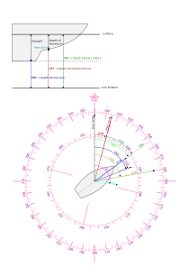

# Calculated Data Plugin for AvNav

This plugin calculates missing data from the data that is supplied to AvNav.

## Calculated Data

- magnetic variation - is calculated at current position based on the [World Magnetic Model](https://www.ncei.noaa.gov/products/world-magnetic-model).
- true heading - from magnetic heading and variation
- set and drift - from ground track and water track
- depth below surface - from depth below transducer and configured depth of transducer
- true and ground wind - from apparent wind and course data
- TODO: leeway estimation

The formulas used for the calculation are best [read directly in the code](plugin.py:375).

All [calculated](plugin.py:282) and [input](plugin.py:32) values are available in AvNav under `gps.calculated.*`. It reads its input data from the AvNav data model, after NMEA parsing hase been done by AvNav.

It also can write [NMEA sentences](plugin.py:58), which are parsed by AvNav itself and are forwarded to NMEA outputs.

## Equations

Heading

$$ HDT = HDM + VAR $$

Set and Drift

$$ [SET,DFT] = [COG,SOG] (+) [CRS,-STW] $$

The \[\oplus\] operator denotes the [addition of polar vectors](https://math.stackexchange.com/questions/1365622/adding-two-polar-vectors).