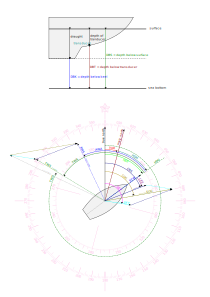

# Calculated Data Plugin for AvNav

This plugin calculates missing data from the data that is supplied to AvNav.

- course - true hading
- wind - true and ground wind
- tide - set and drift
- depth - depth below surface and keel

## Calculated Data

It calculates the magnetic variation at the current position based on the [World Magnetic Model](https://www.ncei.noaa.gov/products/world-magnetic-model).
Using this variation, it can calculate true heading from magnetic heading and vice-versa.

If COG/SOG and HDT/STW are supplied, it will calculate set and drift SET/DFT.

It will calculate true wind angle TWA and speed TWS from apparent wind angle AWA and speed AWS and water speed STW and true wind direction TWD if heading HDT is present.

It will calculate depth below surface DBS and keel DBK for depth below transducer DBT if the depth of transducer and draught have been supplied in the settings.

The formulas used for the calculation are best [read directly in the code](plugin.py:375).

All [calculated](plugin.py:282) and [input](plugin.py:32) values are available in AvNav under `gps.calculated.*`. It reads its input data from the AvNav data model, after NMEA parsing hase been done by AvNav.

It also can write [NMEA sentences](plugin.py:58), which are parsed by AvNav itself and are forwarded to NMEA outputs.

